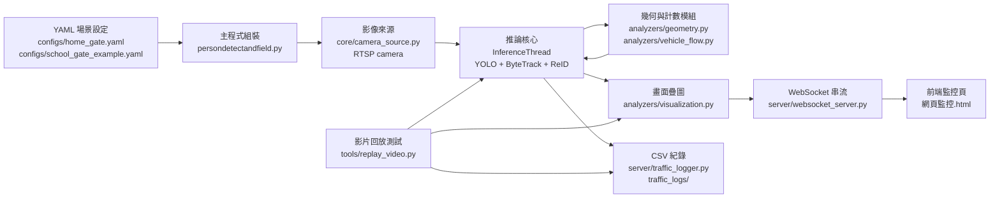
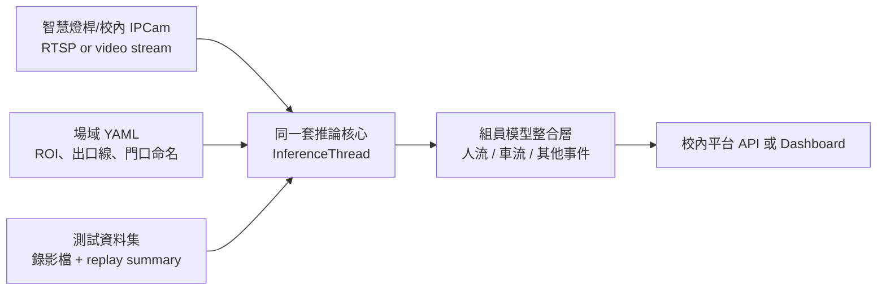

# 系統架構圖

這份文件用來說明目前專案從「家門口單一鏡頭原型」走向「可換場景、可接校內設備」時，各檔案與資料流扮演的角色。

## 橫向資料流

## 模組責任

| 區塊 | 目前檔案 | 責任 |
| --- | --- | --- |
| 場景設定 | `configs/*.yaml` | 攝影機、模型、ROI、出口線、visible exit zone、顯示開關 |
| 啟動組裝 | `persondetectandfield.py` | 載入設定、建立模型、建立影像來源、啟動推論與 WebSocket |
| 攝影機來源 | `core/camera_source.py` | RTSP 讀取、失敗重連、 stale frame 檢查 |
| 影像前處理 | `core/image_utils.py` | 亮度估計、夜間增亮 |
| 外觀特徵 | `core/appearance.py` | ReID 特徵擷取與相似度比對 |
| 行人計數核心 | `persondetectandfield.py::InferenceThread` | 人流追蹤、ROI 狀態、目的地判定、總數加一事件 |
| 幾何工具 | `analyzers/geometry.py` | ROI 命中、線段交會、軌跡平均、IoU、距離 |
| 車流計數 | `analyzers/vehicle_flow.py` | 車種分類統計、車流總數、區間統計 |
| 畫面疊圖 | `analyzers/visualization.py` | 人車框線、軌跡、COUNT +1、debug overlay |
| 即時傳輸 | `server/websocket_server.py` | 把推論 payload 傳給前端 |
| 歷史紀錄 | `server/traffic_logger.py` | 定期寫入 summary CSV、事件 CSV |
| 回放測試 | `tools/replay_video.py` | 用影片檔跑同一套推論核心，輸出標註影片與 JSON 摘要 |

## 校內設備化時的對應

現在最重要的準備不是重寫，而是讓每個場域只需要改 YAML、讓每次計數邏輯修改都能用固定影片回放驗證。這樣之後換成校內智慧燈桿鏡頭時，主要工作會集中在標定 ROI 與出口 zone，不會每換一支鏡頭就改一大段 Python。
